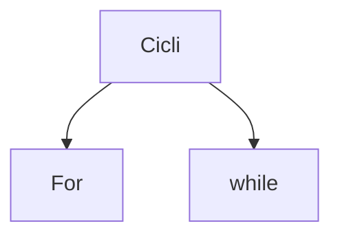

# Loop Python
Un ciclo (o loop) in Python esegue ripetutamente un blocco di codice. Questa operazione viene anche definita "iterazione". Ci sono due tipi di cicli in Python **for** e **while**.
- Un ciclo ha una condizione di permanenza, se è sempre vero questo non si arresta mai.
	- In un ciclo affinché le condizioni di permanenza vengano soddisfatte o meno, i dati all'interno di esso devono essere elaborati e modificati.

- **[[for (Python)]]**: Preferibile per insiemi i cui elementi sono determinati.
- **[[while (Python)]]**: Preferibile per insiemi non definiti
- **[[Nested loop (Python)]]**: quando un ciclo è posizionato all'interno di un altro ciclo.
- **[[break (Python)]]:** esce da un ciclo.
- **[[continue (Python)]]:** salta il resto del blocco di codice corrente.
- **[[else]]:** se le condizioni dei cicli non vengono soddisfatte viene eseguita la parte di codice in else.
