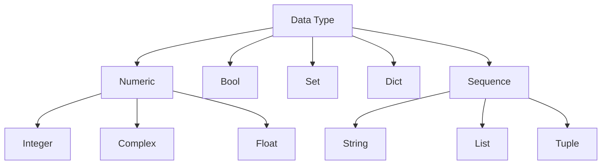

# Python Data types
- [[Numeric Type (Python)|Numeric Type]]: Integer, Float, Complex
- [[Sequence Type (Python)|Sequence Type]]: String (sequenza di caratteri Unicode), List, Tuple
- [[Mapping Type (Python)|Mapping Type]]: Dict (ad un elemento è associata una definizione)
- [[Set Type (Python)|Set Type]]: Set (collezione disordinata di oggetti univoci)
- [[Boolean Type (Python)| Boolean Type]]: Bool

