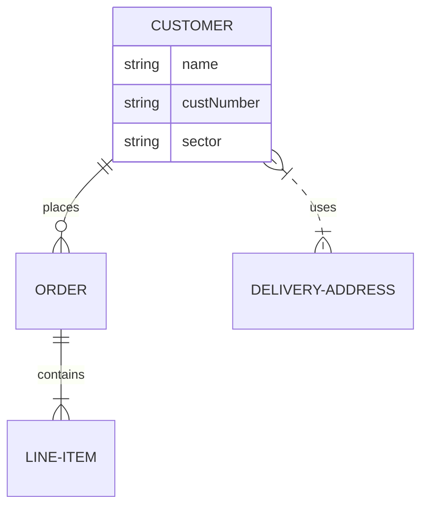

> Sviluppato nel 1973 dai ricercatori IBM per il sistema relazionale System/R

Il linguaggio **SQL (Structured Query Language)** è il linguaggio universale per la definizione e l'uso delle basi di dati relazionali. SQL è lo standard per i DBMS relazionali.
- **Definire la struttura dei dati:** Creare tabelle, definire i tipi di dati, stabilire relazioni tra tabelle e definire vincoli di integrità.
- **Interrogare la base di dati:** Estrarre informazioni specifiche dai dati memorizzati nel database tramite query.   
- **Modificare la base di dati:** Aggiornare, inserire e cancellare i dati.
- **Gestire gli utenti e le autorizzazioni:** Controllare l'accesso ai dati e alle funzionalità del database.
- **Amministrare la base di dati:** Svolgere attività come il backup, il ripristino, l'ottimizzazione delle prestazioni e il monitoraggio.

>[!important] SQL si divide in due sotto linguaggi principali:
>
> * [[Data Definition Language (SQL)]]
> 	* [[Parole chiave per DDL (SQL)]]
>
> * [[DML (Data Manipulation Language)]]
> 	* [[Operatori DML (SQL)]]
# [[Creare tabelle in SQL]]
