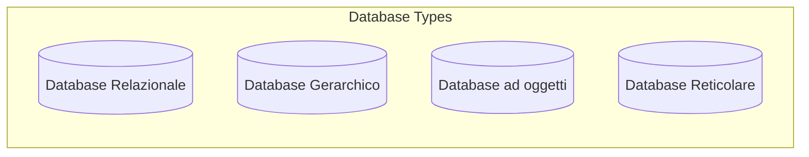
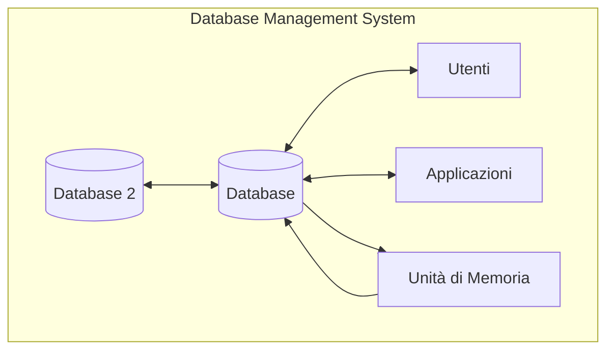

# Database
==Un **Database** o Base di dati, è un [[Sistema azienda]], cioè un insieme di risorse e regole che permettono lo svolgimento coordinato delle attività di un'azienda.==

![[Pasted image 20241024100043.png]]

>[!success]- Le risorse fondamentali di un'azienda
>- **Persone:** Il personale dell'azienda che svolge le attività.
>- **Denaro:** Le risorse finanziarie necessarie per il funzionamento dell'azienda.
>- **Materiali:** I beni tangibili utilizzati dall'azienda, come attrezzature, macchinari e materie prime.
>- **Informazioni:** I dati e le conoscenze supportano le decisioni e le attività dell'azienda.

## Modelli di Database
Il modello di Database da implementare dipende da come si vogliono classificare i dati e da quanto si vuole approfondire la classificazione. I principali sono:
- **I modelli gerarchici**, popolari negli anni '60, organizzano ad albero, con un singolo nodo radice che si dirama in nodi figli.
- **I modelli reticolari**, popolari negli anni '70, sono simili ai modelli gerarchici ma consentono ai nodi figli di avere più nodi padre, creando una struttura a grafo.
- **Il modelli relazionali**, introdotto da E.F. Codd negli anni '80, organizza i dati in modo organizzato in tabelle con righe e colonne, ed è attualmente il modello più utilizzato (*MySQL, PostgreSQL, SQL Server e Oracle*).
- **I modelli non relazionali (NoSQL)**, introdotti alla fine degli anni '90 da Carlo Strozzi, sono progettati per gestire grandi quantità di dati non strutturati o semi-strutturati come testi, immagini e dati provenienti da sensori. Sono più flessibili rispetto ai database relazionali ma offrono meno funzionalità in query (MongoDB, Cassandra, Redis).
- **I modelli a oggetti**, nati negli anni '80, combinano i database con la programmazione orientata agli oggetti.

Oltre a questi, ci sono modelli più recenti come **XML**, che è una rivisitazione del modello gerarchico dove i dati sono presentati insieme alla loro descrizione, e **NoSQL**, con cui si possono gestire grandi quantità di dati non strutturati (Big Data e Applicazioni Web).

> [!example]- Esempi di modelli NoSQL
>- **Document-oriented:** Come MongoDB, che memorizza i dati in documenti JSON.
>- **Key-value:** Come Redis, che memorizza i dati come coppie chiave-valore.
>- **Column-family:** Come Cassandra, che organizza i dati in colonne.
>- **Graph:** Come Neo4j, che rappresenta i dati come grafi di nodi e relazioni.
## Data Base Management System (DBMS)
Un **Data Base Management System (DBMS)**, o sistema di gestione di basi di dati, ==è un software progettato per la creazione, gestione, interrogazione e modifica di grandi insiemi di dati in modo efficiente e sicuro==, consentendone la persistenza nel tempo in un database. Il linguaggio **SQL (Structured Query Language)** è lo standard, utilizzato per la definizione e la manipolazione dei dati.

> [!TIP]- I vantaggi di utilizzare un database informatico
>- **Indipendenza dei dati:** La possibilità di modificare le strutture fisiche dei dati senza dover modificare i programmi che accedono alla base di dati.
>- **Affidabilità :** Un database è costruito in modo a evitare malfunzionamenti software o hardware, garantendo la conservazione dei dati a lungo termine grazie ad una gestione efficace delle transazioni.
>- **Sicurezza:** I DBMS hanno meccanismi per controllare l'accesso ai dati. Ciò garantisce che solo gli utenti autorizzati possano accedere alle informazioni e svolgere determinate operazioni.
>- **Efficienza:** I DBMS sono ottimizzati per gestire grandi quantità di dati e per eseguire interrogazioni in modo veloce ed efficiente, *anche in presenza di accessi concorrenti da parte di più utenti.*
### Meccanismi di autorizzazione
==I meccanismi di autorizzazione sono strumenti fondamentali per garantire la sicurezza dei dati nei sistemi di gestione di basi di dati (DBMS).== Permettono di limitare l'accesso ai dati sensibili solo agli utenti autorizzati, specificando chi può accedere a quali dati e con quali modalità.

- **Privatezza:** Si riferisce alla capacità di definire regole per controllare quali utenti possono accedere a quali dati. Ad esempio, in un sistema universitario, gli studenti potrebbero essere autorizzati a visualizzare solo i propri dati accademici, mentre i docenti potrebbero avere accesso a un set di dati più ampio, inclusi i dati degli studenti iscritti ai propri corsi.
- **Autorizzazioni:** Specificano le operazioni che un utente è autorizzato a eseguire su una determinata risorsa. Ad esempio, un utente potrebbe avere l'autorizzazione a leggere i dati di una tabella, ma non a modificarli o eliminarli.
- **Controllo degli accessi:** Il processo di verifica delle autorizzazioni di un utente prima di concedere l'accesso ai dati. I DBMS utilizzano diversi meccanismi di controllo degli accessi, come il controllo degli accessi basato sui ruoli (RBAC), per gestire le autorizzazioni in modo efficiente.

==Il controllo degli accessi è particolarmente importante in contesti di accesso concorrente ai dati==, dove più utenti o applicazioni possono interagire contemporaneamente con il database. In questi scenari, i meccanismi di autorizzazione contribuiscono a prevenire accessi non autorizzati, modifiche indesiderate o la divulgazione di informazioni riservate. 

> [!example]- Meccanismi di autorizzazione in SQL
> Alcuni esempi di come i meccanismi di autorizzazione possono essere implementati in SQL, il linguaggio standard per la gestione dei database relazionali:
>- **GRANT:** Utilizzato per concedere privilegi specifici su una risorsa a uno o più utenti. Ad esempio, `GRANT SELECT ON Department TO Stefano;` concede all'utente 'Stefano' il privilegio di leggere i dati dalla tabella 'Department'.
>- **REVOKE:** Utilizzato per revocare privilegi precedentemente concessi. Ad esempio, `REVOKE SELECT ON Department FROM Stefano;` revoca il privilegio di lettura sulla tabella 'Department' all'utente 'Stefano'.

### Meccanismi di concorrenza
==I meccanismi di concorrenza sono cruciali nei DBMS per coordinare l'esecuzione di più transazioni concorrenti in modo che l'effetto finale (isolare le transazioni) sia equivalente all'esecuzione delle transazioni in un ordine seriale, garantendo al contempo la **coerenza e l'integrità del database**.== Senza questi meccanismi, potrebbero verificarsi anomalie e inconsistenze nei dati quando più operazioni tentano di leggere o modificare le stesse informazioni contemporaneamente.
- L'isolamento delle transazioni è una delle proprietà **Atomicità, Consistenza, Isolamento e Durabilità(ACID)** che definiscono le caratteristiche desiderabili di una transazione.

> [!WARNING]- Problemi che possono sorgere in assenza di meccanismi di concorrenza
>- **Lettura Sporca (Dirty Read):** Una transazione legge i dati che sono stati modificati da un'altra transazione ma non ancora confermati (commit). Se la prima transazione effettua il rollback, la seconda transazione avrà letto dati non validi.
>- **Lettura Non Ripetibile (Non-Repeatable Read):** Una transazione legge gli stessi dati più volte e ottiene risultati diversi perché un'altra transazione ha modificato i dati nel frattempo.
>- **Scrittura Fantasma (Phantom Read):** Una transazione legge un insieme di dati che soddisfano una determinata condizione, mentre un'altra transazione aggiunge nuovi dati che soddisfano la stessa condizione. La prima transazione, se ripetuta, restituirà un insieme di dati diverso.

Per superare i limiti dell'esecuzione seriale, i DBMS utilizzano tecniche più sofisticate, come il **blocco a due fasi (2PL)**. Con il *2PL*, i dati vengono bloccati a vari livelli (ad esempio, blocco a livello di riga, a livello di pagina o a livello di tabella) prima di essere letti o modificati da una transazione. I blocchi vengono mantenuti fino al termine della transazione, impedendo ad altre transazioni di accedere ai dati bloccati in modo incompatibile. Il blocco a due fasi garantisce la serializzabilità delle transazioni, ovvero l'equivalenza del risultato con un'esecuzione seriale, ma può portare a situazioni di stallo (deadlock) quando due o più transazioni si bloccano a vicenda in attesa del rilascio di un blocco.

I DBMS implementano inoltre meccanismi per **rilevare e gestire gli stalli**, ad esempio interrompendo una delle transazioni coinvolte nello stallo (rollback) per consentire alle altre di procedere. La scelta della transazione da interrompere si basa su criteri come l'età della transazione, le risorse utilizzate e il costo stimato del rollback.

Oltre al controllo della concorrenza basato sul blocco, alcuni DBMS utilizzano **tecniche di versionamento dei dati** per gestire l'accesso concorrente. Invece di bloccare i dati, ogni transazione lavora su una versione (o copia) dei dati. Le modifiche apportate da una transazione non sono visibili alle altre transazioni fino a quando la transazione non viene confermata. Questo approccio aumenta la concorrenza e riduce il rischio di stalli, ma introduce una maggiore complessità nella gestione delle versioni dei dati.
### [[Operazioni su DBMS]]