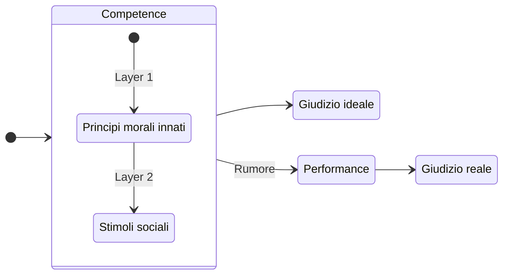

La **morale** (dal latino *moralis*, significante *"costume" o "abitudine"*) ==riguarda quei principi e valori (personali e non) che determinano ciò che è giusto o sbagliato fare.==
- È il contenuto, ossia l'insieme di regole e valori che l'[[Etica|etica]] analizza (valutandone la validità e i fondamenti attraverso un processo di riflessione razionale).
	- Alcuni valori si traducono in [[Normatività#Fenomeno della *correttezza*|obblighi o doveri morali verso gli altri]].

> [!example] Morale *vs* Etica
> Se la morale è un insieme di regole, allora l'etica è lo studio del perché quelle regole esistono e se sono giuste.
> - **Morale:** *"Rubare è sbagliato"*
> - **Etica:** *"Rubare per salvare qualcuno dalla fame è sbagliato?"*
## Morale basata sull'utilitarismo
> *La morale utilitaristica si rifà all'[[Etica#Etica consequenzialista|etica consequenzialista]].*

Inizialmente la morale si basava sul concetto di **utilitarismo**:
- *Un'azione è giusta o sbagliata in base al piacere aggregato*.

Fu chiaro però che **questo modello non poteva essere sostenuto** sul lungo periodo per via di alcune lacune che *Immanuel Kant* evidenziò:
- L'utilitarismo entra in conflitto con un principio fondamentale di ogni società civile e umana, ovvero il **principio di incompensabilità**.

Inoltre, come evidenziato dal teorico di giustizia americano *John Rawls*, l'utilitarismo tratterebbe gli umani come un unico collettivo, senza considerare che ogni individuo vive la propria vita ed è responsabile di essa.
- **L'utilitarismo è inconciliabile con la separatezza delle persone.**

> [!QUESTION] Cos'è il principio di incompensabilità?
> Questo principio implica che non è moralmente accettabile sacrificare i diritti o il benessere di un individuo anche se ciò potrebbe portare a un vantaggio maggiore per un numero più ampio di persone.
> - Non è lecito condannare una persona innocente anche se ciò avrebbe un effetto deterrente alla criminalità.
> - Non è ammissibile abbattere un aereo di linea anche se ciò salverebbe migliaia di vite.
> - Non è consentito portare via qualcosa ad una persona, anche se il vantaggio che ne otterrebbe un'altra più povera fosse maggiore dello svantaggio subito dalla persona derubata.
# Il giudizio morale
- Come funziona il giudizio morale? È il risultato di regole o di intuizioni?
	- *Le intuizioni sono ciò che sentiamo direttamente come giusto, senza pensare all'applicazione di una norma (o regola)*.
- Che ruolo hanno le emozioni nel giudizio morale? L'intuizione è un fatto di regole o di emozioni? Che ruolo hanno le emozioni nell'accettare le regole?
	- *Esiste una verità morale oggettiva?*
## Conflitti e dilemmi
In alcuni casi possono esserci delle **ragioni morali in conflitto**.
- ==Un **conflitto** è un dilemma quando le ragioni appaiono equivalenti poiché nessuna sembra prevalere chiaramente sulle altre.==
- Un **dilemma** è tragico quando qualsiasi soluzione disponibile comporta un grave pregiudizio di beni moralmente rilevanti
### Il trolley problem
Alcuni studiosi come *Philippa R. Foot* e *Judith J. Thomson* crearono degli **dilemmi tragici** per fini sperimentali che presero il nome di *trolley problems*.
I dilemmi interrogano la cavia sul prendere una decisione (inevitabilmente tragica) che riguarda il **salvare una vita umana, o più vite**.

Intuitivamente, la risposta sembrerebbe ovvia: *meglio salvare più vite al cospetto di una*, ma si osserva come alcuni fattori inizialmente sconosciuti possono influenzare le nostre decisioni.
- ==**La nostra presa di decisione è guidata dalle nostre intuizioni**.==

> [!NOTE] Il principio del doppio effetto
> Si potrebbe pensare quindi che l'intuizione sia influenzata dal nostro volere, denotando la differenza tra:
> - *Volere qualcosa come mezzo per un certo scopo*
> - *Accettare qualcosa come effetto collaterale*
> 
> Ad esempio potrebbe essere ammesso recare danno a qualcuno per prevenire un danno più grave soltanto se il danno arrecato è accettato come effetto collaterale, e non se è voluto come mezzo.
> - Su questa falsa riga, *Thomson* elaborò il principio dell'*inviolabilità dello spazio personale*: è permesso recare danno a qualcuno per prevenire un danno maggiore, solo se ciò non implica il compiere un'azione che costituisce una violazione dello spazio personale altrui.
## Le proprietà morali
Le *intuizioni* individuano le **proprietà morali** in modo implicito, inconscio:
- ==Percepiamo direttamente un'azione come giusta o sbagliata== (anziché *concludere* che l'azione sia, appunto, corretta o scorretta) ==perché **ha certe proprietà che la rendono tale**.==
	- *Spesso, anche ex-post (dopo aver pervenuto il giudizio), non siamo in grado di identificare quali sono le proprietà che rendono quell'azione giusta o sbagliata.*

==Possiamo quindi formulare una **teoria morale** che giustifica le nostre intuizioni sulla base di principi generali==: esplicitiamo così le proprietà morali alle quali le nostre intuizioni rispondono implicitamente.
## La teoria morale
La **teoria morale** si occupa di individuare analiticamente le proprietà che rendono l'azione giusta o sbagliata, e renderle esplicite.

Per costruire una teoria morale, si prende una **proprietà morale**
che appare *moralmente rilevante*, si formula un [[Principio morale]] basato su questa proprietà e si verifica se questo riesce a dar conto di tutte le nostre intuizioni.
- Se il principio fallisce, significa che la nostra teoria morale è sbagliata, o quanto meno è incompleta, dunque bisogna trovare principi diversi.
## La *grammatica morale*
*John M. Mikhail* studiò il meccanismo responsabile dei nostri giudizi morali: ==gli umani dispongono di una **grammatica morale**, nella quale si distingue una **competence** e una **performance**.==
- La *competence morale* è stratificata in due *layers*:
	- Il *primo layer* è costituito dalla c.d. **grammatica morale universale:** una serie di principi generali condivisi dalla maggior parte della società.
	- Il *secondo layer* è costituito da una **grammatica morale culturalmente-specifica** che esplica e determina i [[Principio morale|principi morali]] in modi culturalmente variabili.
- Il modello di Mikhail è basato sulla concezione di linguaggio fatta da *Noam Chomsky.*

> [!QUESTION] Cos'è la *competence* e la *performance*?
> - **Competence**: si riferisce alle risposte dei meccanismi morali in condizioni ideali, ovvero in assenza di "*rumore*".
> 	- Il "*rumore*" può includere limitazioni di memoria, distrazioni, spostamenti dell'attenzione o errori
> - **Performance**: si riferisce alle risposte che si verificano in condizioni reali, dove il "*rumore*" è presente e può influenzare il giudizio morale. In altre parole, la *performance* è come la *competence* si manifesta concretamente, tenendo conto dei fattori esterni che possono alterare il giudizio.

## La teoria del doppio processo
Secondo *Joshua Greene* sarebbe utile usare la **teoria del doppio processo** in ambito morale, che consiste nell'adottare due metodi di giudizio:
1. Un primo metodo considerato **automatico**, **immediato**, *guidato dalle intuizioni o emozioni.*
2. Il secondo metodo prodotto dal **ragionamento**.

L'alternarsi di questi due metodi di giudizio sta alla base della vita umana, e in generale gestiscono l'appagamento di alcuni bisogni valutando gli effetti di un'azione a breve o lungo termine.
- *Si è osservato come in determinati casi il cervello preferisca il giudizio immediato, specialmente in situazioni che suscitano una **forte emozione negativa** (che spesso porta a valutazioni errate).*

