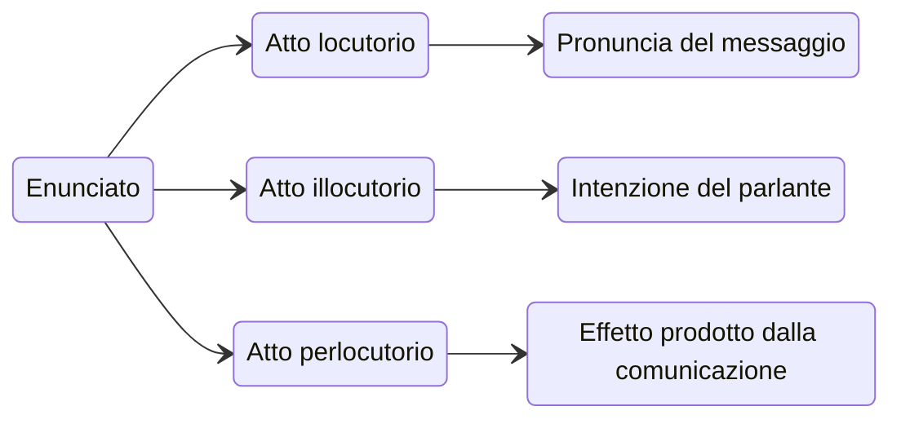

> Lo studio della comunicazione è caratterizzato da un approccio multidisciplinare ([[Il linguaggio|Linguistica]], Neuroscienze, ecc..).

In Psicologia ==**la comunicazione** è il processo di interazione e le modalità di trasmissione di un'informazione tra due o più individui.==

![[Pasted image 20240623225048.png]]
# Il segno
Il segno ha un ruolo fondamentale nell'atto comunicativo in quanto viene utilizzato come funzione comunicativa ed ==è il ponte tra la realtà, la rappresentazione di essa e la possibilità di comunicarla agli altri.== Comunicare significa costruire messaggi composti da *segni*, cioè rappresentazioni mentali di una porzione di realtà (un oggetto, un concetto, un evento, ecc..).
- Il segno è **flessibile** al contesto comunicativo, non è un entità fissa in quanto si presenta come il risultato provvisorio di regole di codifica che stabiliscono correlazioni transitorie.
- Il processo di **significazione** consente di attribuire un significato ad un segno.

> ![[La comunicazione (Psicologia)_image_2.jpeg|600]]
> Il segno porta con sé il vincolo dell'esprimibilità del significato come avviene banalmente nell'atto di indicare, questa è una **funzione segnica**.

>[!question] Cos'è la funzione segnica?
> La funzione segnica è la relazione tra entità intese a significare qualcosa che può mutare al variare del contesto comuncativo.
## Triangolo semiotico (Peirce)
==Il processo di significazione è descritto dal *triangolo semiotico* come come la relazione tra: **segno**, **referente** e **contenuto**.==
- **Il significante** (o segno): il veicolo simbolico del messaggio nella sua dimensione fisica che viene usata per significare.
- **Il referente:** l'oggetto, l'evento o l'azione che viene rappresentata.
- **Il significato** (o contenuto): l'idea mentale del referente che si vuole comunicare.

![[La comunicazione (Psicologia)_image_5.jpg|600]]
## Segno come equivalenza (Violi, 1966)
Viene formulata all'interno della linguistica strutturale nell'eccezione di De Saussure (1916). ==Il segno viene definito come l'unione di un'immagine acustica e di un'immagine mentale== cioè del **significante** (ad esempio un suono, una parola) al **significato** (il concetto mentale).
- *In questa visione prevale la natura stabile del segno.*
- Il segno è un'entità a *rapporto fisso* composta da due elementi fondamentali: **significante** (immagine) e **significato** (concetto mentale).
- **Valore di oppositività:** Il valore di un segno deriva dalla sua contrapposizione con gli altri segni all'interno del sistema linguistico.
- **Valore di arbitrarietà:** L'associazione tra significante e significato è arbitrariamente stabilita per mezzo di un **codice**.
	- Per **codice** si intende un sistema regolato di segni i cui significati sono stati arbitrariamente stabiliti e posti per convenzione.

>![[La comunicazione (Psicologia)_image_3.webp|600]]
> La parola "cane" è un segno linguistico. Il significante è la sequenza di suoni $/k/ /a/ /n/ /e/$, mentre il significato è il concetto mentale di un animale domestico a quattro zampe.
## Segno come inferenza (Peirce, 1931)
Viene formulata all'interno della semiotica. ==In questa prospettiva prevale la natura interpretativa del segno==, in cui l'interpretante (il soggetto che riceve il segno) trae conclusioni sulla base del segno stesso e del contesto in cui viene usato.
- *In questa visione prevale la natura dinamica del segno.*
- "Il segno è qualcosa che per qualcuno sta al posto di qualcos'altro in qualche modo".
- **Inferenza:** Il segno non è un'entità statica, ma rimanda ad un'idea (o ad un referenza) attraverso un processo di inferenza.
- **Variabilità:** Il significato di un segno non è fisso, ma è **flessibile** in base al contesto e all'esperienza dell'interpretante → Semiosi illimitata*** (attribuzione illimitata del significato).

>![[La comunicazione (Psicologia)_image_4.jpeg|400]]
> Un'impronta di scarpe sulla neve può essere un segno della presenza di un essere umano nelle vicinanze (inferenza).
# Trasmettere informazioni
Trasmettere informazioni significa spostare l'informazione da un mittente ad un destinatario. 
- *Modello matematico della comunicazione*: l'informazione è l'unità minima che compone il segnale .
- *Teoria degli atti linguistici* (Austin): affinché il segnale venga mandato con successo dall'emittente e recepito correttamente dal destinatario, questi devono mettere in atto una serie di accorgimenti: *in questo senso comunicare è fare*.
## ![[Modello matematico della comunicazione]]
## Teoria degli atti linguistici (Austin)
*"Dire qualcosa è pur sempre fare qualcosa!"*

1. **Atto locutorio**: è l'atto di produrre un enunciato con un determinato significato e riferimento.
	- Si tratta del livello più basilare, che riguarda la forma linguistica dell'enunciato.
2. **Atto illocutorio**: è l'atto di compiere qualcosa con l'enunciato, come affermare, ordinare, domandare o promettere.
	- Si tratta dell'intenzione comunicativa del parlante.
3. **Atto perlocutorio**: è l'effetto che l'enunciato produce sull'ascoltatore, come convincerlo, farlo arrabbiare o indurlo a compiere un'azione.
	- Si tratta del risultato ottenuto dal parlante.

> [!example] "Vi dichiaro marito e moglie!"
> Per esempio, l'iconica frase che congiunge i due sposi possono essere distinti:
> - L'atto locutorio costituito dalle parole pronunciate dal sacerdote;
> - L'atto illocutorio costituito dall'intenzione di unire in matrimonio due persone;
> - L'atto perlocutorio costituito dal fatto che dopo la dichiarazione la realtà delle due persone è realmente mutata.
# L'intenzione comunicativa
Durante la comunicazione il fuoco dell'attenzione viene spostato dai processi di codifica/decodifica del messaggio ai *processi di interpretazione*, il messaggio è uno strumento per raggiungere l'intenzione comunicativa.
==L'**intenzione comunicativa** è il proposito per cui un individuo produce un messaggio==: è la **motivazione** che sta alla base della comunicazione e che determina il 'perché' dell'atto linguistico.
- *Si informa il destinatario di qualcosa.*
- Levelt descrisse il percorso che l'intenzione comunicativa compie per diventare articolazione verbale:
	1. **Concettualizzazione**: viene specificata la rappresentazione semantica di ciò che si intende dire.
	2. **Formulazione**: traduce la struttura semantica in una struttura linguistica attraverso la *codifica grammaticale* e la *sintassi*.
	3. **Articolazione**: l'esecuzione della proposizione per mezzo della muscolatura, la parola o la frase pronunciata.

![[L'intenzione comunicativa (Psicologia)_image_1.png|600]]
## La pragmatica
==Il significato di un messaggio è il risultato di un'azione interpretativa compiuta dal parlante e dall'ascoltatore in modo interdipendente in un contesto preciso.==
- La pragmatica si sviluppa come ***critica all'analisi strutturale del linguaggio***, il senso della parola non si può cogliere isolatamente ma solo entro un contesto.
- "Il senso di una parola non si può cogliere isolatamente ma solo entro un contesto e che il linguaggio non rappresenta un mondo di cose ma la nostra attività sulle cose".

>[!note] Approccio gestaltista alla comunicazione
>L'approccio teorico-metodologico gestaltista al linguaggio e alla comunicazione considera la Gestalt linguistica, come un tutt'unico, articolato al suo interno e dotato di proprietà globali, le quali non sono solo il risultato sommativo delle singole proprietà dei suoi elementi costitutivi ma dipendono dalla sua struttura, ossia dal sistema di relazioni tra le parti, dalle diverse funzioni o ruoli svolti dalle parti al suo interno.
> - *Esiste dunque una dipendenza reciproca tra qualità globali del tutto e qualità funzionali delle parti.*
## L'intenzione reciproca (Grice)
Secondo Grice la comunicazione è un processo costituito da un emittente che ha intenzione di far sì che il ricevente pensi o faccia qualcosa, operando in modo tale che il ricevente riconosca che il mittente sta cercando di causare in lui quel pensiero o quell'azione. ==Sono i princìpi regolativi che governano la conversazione secondo logica e pertinenza==, come pure nel rispetto del principio di cooperazione fra parlanti.
- L'intenzione comunicativa dell'emittente diventa quindi conoscenza reciproca.
- I **principi di cooperazione** poggiano su una concezione pragmatica del linguaggio, inteso come una forma di azione necessaria al momento opportuno.
- **La reciproca conoscenza dell'intenzione comunicativa è condizione necessaria alla comunicazione.**
- Promuove la **coordinazione** e la **cooperazione** tra gli individui, facilitando il raggiungimento di obiettivi comuni.

![[L'intenzione comunicativa (Psicologia)_image_3.png|500]]

### Il principio di cooperazione di Grice
Secondo Grice una buona comunicazione si basa sul rispetto del "*Principio di cooperazione*":
- *Dai il tuo contributo al momento opportuno, così com'è richiesto dagli scopi e dall'orientamento della conversazione in cui sei impegnato*. Le 4 massime sono:
 
1. **Massima di Qualità:** cerca di fornire un contributo vero, non dire cose che credi false.
2. **Massima di Quantità:** cerca di fornire un contributo che soddisfi la richiesta di informazioni in modo adeguato agli scopi del discorso.
3. **Massima di Relazione:** cerca di fornire contributi pertinenti
4. **Massima di Modo:** sii chiaro, evita oscurità di espressione o ambiguità, sii breve e procedi ordinatamente.

***Violazione delle massime:***
Se un parlante viola una o più massime, non significa necessariamente che egli stia rifiutando la cooperazione; conscio di ciò, l'interlocutore tenterà di armonizzare l'apparente inconciliabilità fra la violazione e il desiderio di cooperare, non rinunciando dunque a presumerlo nel parlante.

1. È possibile violare una massima in maniera non evidente, consentendo così, in determinate situazioni, di trarre in inganno l'altro interlocutore.
2. È possibile dissociarsi sia dalle massime che dal principio di cooperazione, mostrando in maniera evidente che non si ha intenzione di cooperare.
3. È possibile ritrovarsi in "conflitto", nel senso che non è possibile soddisfare una massima senza contemporaneamente però violarne un'altra.
4. È possibile, infine, burlarsi o prendersi gioco di una massima, ostentandone la mancata soddisfazione.
## Modello ostensivo-inferenziale (Sperber & Wilson)
==Il modello ostensivo-inferenziale contribuisce alla definizione di *intenzione comunicativa* e vede la comunicazione come un processo di **ostensione e inferenza** in cui il destinatario di un messaggio cerca di ***ricostruire l'intenzione comunicativa*** del mittente.==

![[Pasted image 20240620110022.png|600]]

Secondo il *MOI*, la comunicazione avviene in due fasi:
1) **Ostensione:** Il mittente emette un segnale (un messaggio) che intende essere informativo per il destinatario. Il segnale può essere verbale (parole) o non verbale (gesti, espressioni facciali).
2) **Inferenza:** Il destinatario del segnale cerca di inferire l'intenzione del mittente, cioè ricerca il significato che il mittente ha voluto associare al segnale. Il destinatario fa questo sulla base delle sue conoscenze del mondo, del contesto in cui si trova e delle sue conoscenze sul mittente.
- E' fondamentale il **principio di pertinenza** (introdotto da Grice): un input può essere più o meno *pertinente*, più è pertinente più è stimolante (minore sforzo cognitivo -> maggiore pertinenza.)
	- Un input è pertinente quando produce un segnale cognitivo
	- I messaggi *più pertinenti* sono quelli che sono *più informativi*, dato il contesto e le conoscenze del destinatario.
	- I messaggi *meno pertinenti* sono quelli che sono *meno informativi*, dato il contesto e le conoscenze del destinatario.
	- Il destinatario può scegliere di *ignorare* un messaggio se lo ritiene *non pertinente*.
	- Gli esseri umani sono *massimizzatori di pertinenza*.
## We-intention (Searle)
Descrive lo scopo comune condiviso da due o più individui di raggiungere un determinato risultato che altrimenti non avrebbero potuto perseguire. ==E' un'intenzione comunicativa collettiva che non può essere raggiunta da soli.==
- I comunicanti devono agire in maniera differenziata, coordinata e complementare.

> ![[Pasted image 20240620110318.png|500]]
> *L'uomo è naturalmente predisposto a cooperare con gli altri.*

> [!warning] Questione di sintonia!
> Per sintonizzarsi (e sincronizzarsi) si mettono in atto un insieme di comportamenti interpersonali finalizzati al raggiungimento di un'intenzione congiunta.
> - *E' l'insieme di mosse necessarie a porsi sulla stessa lunghezza d'onda* e definire le condizioni per una intenzione condivisa.
> - Le persone sintonizzate tendono a modulare alcune caratteristiche del proprio stile comunicativo in funzione di quello del proprio interlocutore, le *modificazioni* possono essere effettuate in direzione:
> 	- **convergente** (avvicinamento allo stile comunicativo) o 
> 	- **divergente** (allontanamento per segnalare la necessità di una modificazione nel comportamento comunicativo).
> - Una delle prime sintonizzazioni avviene durante i primi anni di vita, in particolar modo con la madre.
> 
# I mezzi di comunicazione
Siamo in grado di condividere (trasmettere) **segni** attraverso i c.d. **medium** (o mezzi di comunicazione), che ci permettono di entrare in relazione e comunicare con l'ambiente o con un interlocutore: ==un **medium** è qualunque elemento e/o strumento che ci permetta di entrare in relazione e di comunicare con l'ambiente esterno.==
- *Nel momento in cui si utilizza un certo medium per interagire con gli altri, le caratteristiche intrinseche di questo richiedono ai suoi utilizzatori di adattare il proprio stile comunicativo.*

Ogni medium (o mezzo comunicativo) può essere analizzato facendo riferimento a 3 dimensioni:
1. **Dimensione fisica**: include le caratteristiche fisiche del medium.
2. **Dimensione simbolica**: include l'insieme dei significati espressi attraverso il medium.
3. **Dimensione pragmatica**: è l'insieme dei comportamenti con cui i soggetti utilizzano il medium.

> [!warning] Esempio - libri come mezzo comunicativo
> - *Dimensione fisica:* I libri sono composti da pagine di carta stampata, rilegati insieme, con copertina rigida o flessibile.
> - *Dimensione simbolica:* I libri contengono testo scritto, immagini e altri simboli che trasmettono conoscenze, storie, emozioni e idee. Il contenuto di un libro può avere significati profondi e complessi.
> - *Dimensione pragmatica:* Le persone leggono libri per diversi scopi, come l'intrattenimento, l'educazione, la ricerca o la crescita personale. I libri possono essere letti in silenzio da soli o ad alta voce per condividere la lettura con altri.
## I livelli di presenza
Il senso di *presenza* fa riferimento alla possibilità di azione del soggetto.
L'evoluzione delle tecnologie tende sempre maggiormente a creare mondi simulati sempre più coinvolgenti, ciò ha condotto alla definizione di nuovi differenti ***livelli di presenza***:
- **Presenza fisica**, cioè l'esistenza di un soggetto in una regione spazio-temporale (ad esempio un concerto live).
- **Presenza soggettiva**, cioè la percezione di essere collocato nello scenario spazio-temporale in cui si verifica l'evento (ad esempio la visione di un film).
- **Presenza interattiva**, cioè senso di presenza coniugato all'azione del soggetto all'interno del mondo virtuale, dato un determinato grado di coinvolgimento (ad esempio i social media).
# Interazione e relazione
La comunicazione è inanzitutto interazione: ==si tratta di un processo bidirezionale in cui due o più individui si scambiano informazioni, idee ed emozioni.==
- L'interazione è ciò che rende la comunicazione dinamica e permette di costruire relazioni tra le persone.

E' possibile distinguere 3 aree di indagine nello studio della comunicazione come interazione:
1. **L'approccio interazionista** analizza il comportamento non verbale
2. **La teoria generale dei sistemi** studia l'influenza della comunicazione nella strutturazione del sé.
3. **Lo sviluppo ontologico della comunicazione** riguarda la dimensione evolutiva, parla della pertinentizzazione e di acquisizione del mondo dei significati che il bambino sviluppa in interazione con gli adulti.
## Approccio interazionista (serie di studi)
E' un approccio che considera la comunicazione come una costruzione finalizzata alla trasmissione di contenuti e alla gestione dell'interazione comunicativa.
- Secondo questo approccio, il mondo sociale non è una realtà oggettiva e predefinita, ma è il prodotto di una continua interazione tra individui (ad esempio il modo in cui interpretiamo le azioni degli altri è influenzato dalle nostre interazioni passate e dalle nostre aspettative).
- L'unità di analisi non è pertanto costituita dal singolo comportamento comunicativo, bensì l'approccio **studia l'organizzazione del comportamento comunicativo** da parte degli interagenti nel quale si intrecciano *comunicazioni verbali* e *non verbali* (ad esempio il modo in cui ci vestiamo può essere un modo per comunicare agli altri chi siamo e come vogliamo essere percepiti).
- Il pensiero simbolico ci permette di parlare di quanto accaduto nel passato, nonché di ipotizzare cosa potrebbe accadere nel futuro.
	- Ci consente di uscire dalla condizione presente per evocare un'altra realtà, passata o futura.

> [!example]
> Immagina un bambino che gioca con un giocattolo. All'inizio, il bambino interagisce con il giocattolo toccandolo e manipolandolo, questo è lo **stadio senso-motorio**. Ma poi, il bambino inizia a capire che il giocattolo può rappresentare qualcosa di diverso, come un personaggio di una storia. Questo è il passaggio all'**intelligenza rappresentativa**.
## Teoria generale dei sistemi (Bertalanffy)
La *Teoria generale dei sistemi* è un approccio interdisciplinare che esamina le proprietà e la costituzione di un sistema (in questo caso della comunicazione) nel suo insieme. ==La TGS si basa sull'idea che i sistemi siano composti da parti interconnesse che interagiscono tra loro per raggiungere un obiettivo comune==: la relazione tra gli elementi del sistema non è data dalla somma dei singoli elementi ma dalla somma delle loro interazioni.
- E' la relazione a definire gli interagenti e non le caratteristiche dei soggetti a definire la relazione.
- **La comunicazione svolge un ruolo fondamentale nella strutturazione del sé**. Attraverso la comunicazione, gli individui:
		- **Interagiscono con gli altri:** La comunicazione permette agli individui di interagire con gli altri e di costruire relazioni sociali.
		- **Sviluppano il loro senso di identità:** La comunicazione permette agli individui di definire chi sono e di comunicare la loro identità agli altri.
		- **Apprendono:** La comunicazione permette agli individui di apprendere dagli altri e di acquisire nuove conoscenze.
		- **Regolano le loro [[Emozioni|emozioni]]:** La comunicazione permette agli individui di esprimere le loro emozioni e di regolarle in modo efficace.

> [!example] Parallelismo con la matematica
> La funzione $x:y=j:z$ è un rapporto tra variabili, tale per cui nessuna variabile è definibile se non all'interno della funzione e in relazione con le altre variabili. 
> In modo analogo, la relazione tra soggetti o il sistema definito tra questi soggetti (ad esempio la famiglia) è data non dalla somma dei suoi elementi ma dalle interazioni del sistema. 
## Metacomunicazione (Bateson)
Come sostiene lo psicologo Bateson gli individui "non si mettono in comunicazione, bensì sono in comunicazione": i partecipanti alla comunicazione meta-comunicano sul loro reciproco modo di percepire se stessi e l'altro (ogni qualvolta un individuo comunica qualcosa ad un altro, contemporaneamente egli definisce se stesso da una relazione con l'altro e dalla relazione che li unisce).

![[Pasted image 20240620113113.png]]

Bateson osservò che ogni comunicatore procede su due livelli distinti e interdipendenti:
- **Livello di notizia:** il contenuto di un atto comunicativo.
- **Livello di comando:** indicazioni all'interlocutore su come intendere il messaggio.
## Apprendimento e sviluppo ontogenetico della comunicazione
*Lo sviluppo ontogenetico della comunicazione* riguarda l'evoluzione della competenza comunicativa nei bambini durante la loro crescita. Esploriamo le tappe chiave di questo processo:

![[Pasted image 20240620113608.png|600]]
### Decontestualizzazione
1) Inizialmente, il bambino utilizza *simboli* che sono compresi principalmente dai familiari. Questi simboli sono legati a specifici schemi di azione.
2) Con il tempo, le strategie comunicative del bambino si sganciano da questi schemi specifici e diventano più flessibili.
### Convenzionalizzazione
3) Durante questa fase, il bambino comincia a costruire **rituali comunicativi**. Ad esempio, potrebbe utilizzare espressioni come "bubu settete" per indicare la necessità di mangiare o bere.
4) Questi rituali sono *convenzioni* che si sviluppano all'interno del contesto familiare.
### Desostanzializzazione:
5) Qui, il bambino inizia a utilizzare **simboli convenzionali**. Ad esempio, passa dalla parola "bau bau" per indicare un cane al termine più generico "cane".
6) Questo processo di desostanzializzazione implica una comprensione più astratta e generalizzata dei simboli.
# Il linguaggio
==Un linguaggio è un sistema di **segni**==. I segni possono essere:
- **Suoni** (o fonemi): l'unità più piccola del linguaggio.
- **Grammatica**: le regole necessarie alla corretta costruzione delle frasi
- **Sintassi**: regole per l'ordine delle parole
- **Morfologia**: regole per la formazione delle parole
- **Semantica**: significato di parole e frasi
- **Pragmatica**: prende in esame le parole all'interno del loro contesto di utilizzo.

>![[Il linguaggio_image_1.jpg]]
>==Il linguaggio ci permette di condividere con l'interlocutore aspetti della realtà==, anche al di fuori della contingenza temporale.
## Il linguaggio verbale
Il linguaggio verbale e il pensiero sono strettamente interconnessi.
*La comunicazione verbale* avviene attraverso l'uso di parole, sia scritte che orali. È il canale più utilizzato per trasmettere informazioni complesse e articolate.
- E' un processo cruciale per i bambini: è stato dimostrato che un periodo iniziale di esposizione alla lingua madre dà avvio allo sviluppo della competenza linguistica nei neonati. 
- La **sintassi** permette di porre questi costrutti in una successione ordinata gerarchicamente.

### Componenti del linguaggio verbale
Il linguaggio verbale è un sistema complesso che si compone di diverse componenti interconnesse:

1. **Fonologia:** Studia i suoni (fonemi) di una lingua e le regole che governano la loro combinazione. Ad esempio, in italiano, la parola "cane" è composta dai fonemi /k/, /a/, /n/, /e/.
2. **Morfologia:** Studia la struttura interna delle parole e le regole per la formazione di nuove parole (morfemi). Ad esempio, la parola "cani" è composta dal morfema lessicale "can-" (che indica il concetto di cane) e dal morfema grammaticale "-i" (che indica il plurale).
3. **Sintassi:** Studia le regole che governano la combinazione delle parole per formare frasi e discorsi. Ad esempio, in italiano, la frase "Il cane abbaia" segue una struttura sintattica soggetto-verbo-complemento oggetto.
4. **Semantica:** Studia il significato delle parole, delle frasi e dei discorsi. Ad esempio, la parola "cane" si riferisce a un animale domestico a quattro zampe, mentre la frase "Il cane abbaia" descrive un'azione specifica.
5. **Pragmatica:** Studia l'uso del linguaggio nel contesto sociale e comunicativo. Ad esempio, la frase "Il cane abbaia" può essere interpretata in modi diversi a seconda del contesto: può essere un avvertimento, una semplice osservazione o un'espressione di fastidio.
6. **Lessico:** È l'insieme di tutte le parole di una lingua. Il lessico è in continua evoluzione, con nuove parole che vengono create e vecchie parole che cadono in disuso.
7. **Grammatica:** È l'insieme delle regole che governano la fonologia, la morfologia e la sintassi di una lingua. La grammatica ci permette di costruire frasi corrette e comprensibili.

Queste componenti interagiscono tra loro per creare un sistema linguistico complesso e flessibile, che ci permette di esprimere una vasta gamma di pensieri, emozioni e intenzioni.
### Stadi dello sviluppo verbale
Si identificano 4 stadi di sviluppo linguistico:
1. **Stadio fonatorio** nei primi mesi di vita
2. **Stadio primitivo fonatorio** intorno a 6-9 mesi
3. **Stadio di espansione** intorno all'anno di età
4. **Stadio canonico** intorno al secondo anno di età

Si identificano 3 teorie sullo sviluppo del linguaggio:
- **Teoria associazionista**: il linguaggio è imparato per associazioni.
- **Teoria innatista**: il linguaggio è componente innata dell'uomo.
- **Teoria interazionista**: il linguaggio è appreso da una continua interazione con l'ambiente.
### Sviluppo del linguaggio
I neonati sono particolarmente sensibili all'esposizione alla lingua madre durante i primi mesi di vita.
- Questo periodo critico è fondamentale per avviare lo sviluppo della **competenza linguistica**. L'esposizione costante alla lingua madre aiuta il bambino a imparare i suoni, le parole e le strutture linguistiche specifiche della sua cultura.
- L'ambiente gioca un ruolo cruciale nello sviluppo del linguaggio.
#### Stadi di sviluppo linguistico
Gli esperti hanno identificato **quattro stadi** nel processo di sviluppo linguistico:
1. **Stadio fonatorio**: durante i primi mesi, i neonati emettono suoni vocalici e consonantici senza un significato specifico.
2. **Stadio primitivo fonatorio**: intorno ai 2-4 mesi, i bambini iniziano a produrre sequenze di suoni, come "baba" o "gaga".
3. **Stadio di espansione**: intorno ai 4-8, i bambini sperimentano con una varietà di suoni e combinazioni sillabiche. Iniziano a comprendere alcune parole e a rispondere a comandi semplici.
4. **Stadio canonico**: verso i 5-12 mesi, i bambini iniziano a utilizzare parole con significato specifico. La loro produzione linguistica diventa più comprensibile e iniziano a formare frasi semplici.
- *Fino ai 30 mesi si ha il periodo di massima velocità di espansione del vocabolario.*

#### Teorie sull'acquisizione del linguaggio
Le **teorie sull'acquisizione del linguaggio** esplorano i meccanismi che regolano come gli esseri umani imparano a comunicare attraverso il linguaggio. Non esiste un'unica teoria, ma diverse prospettive che cercano di spiegare questo processo complesso. Tra le principali teorie di acquisizione del linguaggio troviamo:

- Teoria *associazionista* (o empiristica) secondo cui il linguaggio è una normale capacità umana che viene appresa attraverso l'associazione positiva ad uno stimolo;
- teoria *innatista* secondo cui il linguaggio è innato nell'uomo, il quale possiede a priori strutture che gli permettono di comprendere e imparare un linguaggio;
- teoria *interazionista* secondo cui il linguaggio è appreso dall'ambiente, come se fosse un grande libro da cui apprendere.
##### Posizione associazionista
Il linguaggio è un processo fondato su meccanismi associativi, frutto dell'esperienza. - Secondo questa prospettiva, il linguaggio è assimilabile agli altri comportamenti umani. Viene appreso dal bambino tramite **stimoli ambientali** che sono più determinanti del soggetto in sé.
- Non vi è alcuna competenza linguistica innata, l'apprendimento del linguaggio avviene tramite processi di associazione stimolo-risposta.
- Bambino dice "mamma" e viene abbracciato
- Interviene il modellamento
- Più si parla più il bambino diventerà bravo a parlare
##### Posizione innatista
Questa teoria, sviluppata principalmente da **Noam Chomsky**, sostiene che gli esseri umani nascono con una **predisposizione innata** per acquisire il linguaggio.

- La **competenza linguistica** rappresenta la **capacità universale** di comprendere e produrre un numero infinito di frasi in base a un **numero finito di regole**. Ogni essere umano nasce con questa competenza innata. È come se avessimo un "programma" linguistico preinstallato nel nostro cervello.
- La **performance linguistica**, riguarda la **capacità di produrre il linguaggio** nella pratica quotidiana. Questo aspetto del linguaggio è influenzato dall'esperienza, dal contesto e da fattori esterni.

Chomsky ipotizza due concetti innati:
1. *Grammatica universale* cioè conoscenza geneticamente determinata dalle regole e dei principi della grammatica, rappresenta una struttura comune a tutte le lingue.
2. *Strumento innato per l'acquisizione del linguaggio*, cioè una struttura mentale innata che consente agli individui di acquisire aspetti complessi della grammatica della propria madrelingua a partire dal linguaggio che sentono

>[!info] La grammatica universale secondo Chomsky
>Il linguista Noam Chomsky sostenne che gli esseri umani nascono con una capacità linguistica innata che emerge con lo sviluppo. Secondo le sue analisi, tutte le lingue del mondo condividono una struttura comune chiamata *grammatica universale.*

## Il linguaggio non verbale
La comunicazione non verbale (CNV) è un sistema di comunicazione complesso che va oltre il significato letterale delle parole. Essa comprende tutti gli aspetti dello scambio comunicativo che si esprimono attraverso il linguaggio del corpo, inclusi:

- **Cinesica:** movimenti del corpo, postura, gesti, espressioni facciali.
- **Prossemica:** uso dello spazio e della distanza interpersonale.
- **Paralinguistica:** tono di voce, volume, ritmo, pause.
- **Cronemica:** uso del tempo nella comunicazione.
- **Aptica:** contatto fisico (strette di mano, abbracci, pacche sulle spalle).

>![[Il linguaggio_image_2.jpg]]
> ***La comunicazione non verbale*** avviene attraverso i *movimenti del corpo*, le espressioni facciali, il tono della voce e la gestualità.

**Un canale primario per le emozioni e le relazioni**
La CNV è un canale fondamentale per trasmettere emozioni, atteggiamenti e intenzioni, spesso in modo più immediato e autentico rispetto al linguaggio verbale. Le espressioni facciali, ad esempio, possono rivelare gioia, tristezza, rabbia o paura in modo universale, indipendentemente dalla cultura di appartenenza.

**Origini e funzioni della CNV**
Il linguaggio non verbale precede ontogeneticamente e filogeneticamente quello verbale. Ciò significa che si sviluppa prima nel corso della vita di un individuo (ontogenesi) e che è presente anche in specie animali non dotate di linguaggio verbale (filogenesi).

La CNV svolge diverse funzioni cruciali:
- **Espressione delle emozioni:** Manifesta i nostri stati emotivi interni.
- **Regolazione delle interazioni:** Segnala turni di parola, interesse, accordo o disaccordo.
- **Presentazione di sé:** Comunica la nostra identità, status sociale e atteggiamenti.
- **Definizione delle relazioni:** Esprime vicinanza, dominanza, sottomissione o conflitto.
- **Persuasione e influenza:** Rafforza o contraddice il messaggio verbale, influenzando l'interlocutore.

**Universalità e variabilità culturale**
Alcune componenti della CNV, come le espressioni facciali di base, sono universali e biologicamente determinate. Tuttavia, la cultura gioca un ruolo importante nel modellare l'uso e l'interpretazione dei segnali non verbali. Ad esempio, il contatto visivo può essere interpretato come segno di rispetto in alcune culture e come segno di sfida in altre.

**Processi automatici e controllati**
La CNV è governata sia da processi automatici, spesso inconsapevoli, sia da processi controllati, che implicano una maggiore consapevolezza e intenzionalità. Ad esempio, arrossire per l'imbarazzo è un processo automatico, mentre sorridere per mostrare gentilezza può essere un atto controllato.
# L'atto comunicativo globale
L'atto comunicativo globale è un concetto che si riferisce alla comunicazione come un'entità complessa, organizzata e articolata in molteplici atti molecolari.

 > [!info] Gli atti molecolari
 > Gli atti molecolari sono una successione di fenomeni e sono regolati e sovraordinati dall'intenzione comunicativa, che stabilisce tra i segni delle relazioni semiotiche. 
 > Il significato del singolo è dato dal valore suo semantico all'interno di una relazione tra segni.

Gli esseri umani sono caratterizzati dall'intermodalità semantica ovvero dall'uso di linguaggi diversi (parole, gesti, ecc.) in media diversi (corpo, telefono, social media, ecc.) per comunicare messaggi dotati di significato. Utilizziamo quindi diversi strumenti (anche contemporaneamente, ad esempio i nostri sensi) per esprimere e interpretare il significato di un messaggio.

**L'atto comunicativo globale come sistema:**
L'atto comunicativo globale può essere visto come un sistema complesso, composto da una moltitudine di atti molecolari. Questi atti molecolari sono i singoli elementi che costituiscono l'atto comunicativo, come le parole pronunciate, i gesti, le espressioni facciali, il tono di voce, ecc.

**L'intenzione comunicativa come guida:**
L'intenzione comunicativa è il collante che tiene insieme gli atti molecolari e dà loro un significato unitario. È l'obiettivo che il comunicatore si prefigge di raggiungere attraverso la comunicazione, che può essere informare, persuadere, intrattenere, ecc. L'intenzione comunicativa guida la scelta degli atti molecolari e ne determina il significato complessivo.

**L'intermodalità semantica come risorsa:**
Gli esseri umani sono naturalmente predisposti all'intermodalità semantica, ovvero alla capacità di utilizzare diversi linguaggi e mezzi per comunicare. Questa capacità ci permette di esprimere e interpretare il significato di un messaggio in modo più completo e sfumato. Ad esempio, possiamo utilizzare le parole per trasmettere informazioni, i gesti per enfatizzare il nostro discorso, le espressioni facciali per mostrare le nostre emozioni, ecc.

**Il significato come risultato dell'interazione:**
Il significato di un atto comunicativo globale non è dato semplicemente dalla somma dei significati dei singoli atti molecolari, ma è il risultato dell'interazione tra di essi. Il significato emerge dalla relazione tra i segni, dal contesto in cui avviene la comunicazione e dalle intenzioni dei comunicatori.