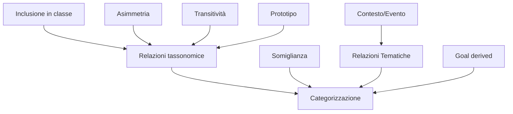
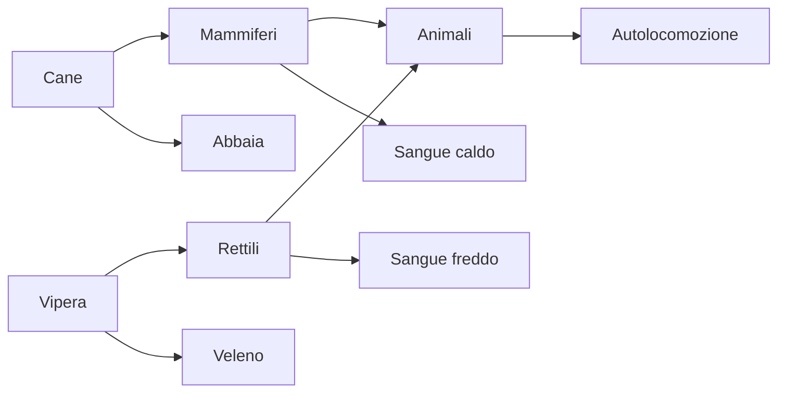

---
tags:
  - scienze-cognitive
  - categorization
  - taxonomy
---

Secondo Collins e Quillian (1969) per manipolare e utilizzare le informazioni è necessario ==**categorizzarle**, cioè semplificarle sotto forma di *concetto*==. Quindi il pensiero permette di formare categorie schematiche legate a contesti e situazioni specifiche. Ciò permette di *selezionare e organizzare il flusso* dell'esperienza in modo da gestire l'enorme mole di dati.
- La categorizzazione avviene in funzione di somiglianze e differenze.
- E' un processo dinamico, l'organizzazione non è definita (o situata).

> [!note] L'organizzazione del pensiero in categorie
>- *L'economia cognitiva*: la nostra mente utilizza i processi di comprensione della realtà più semplici e funzionali.
>- *La struttura del mondo percepito*: gli oggetti vengono percepiti come dotati di una struttura correlazionale.

***L'organizzazione in categorie si basa su principi psicologici:***
- **Economia cognitiva:** rappresenta la tendenza ad ottenere il maggior numero di informazioni possibile con il minor sforzo cognitivo possibile.
	- E' essenziale perciò la semplificazione della realtà.
	- Il processo di categorizzazione comporta un importante carico cognitivo che potrebbe limitare la quantità di informazioni percepite.
- **Struttura del mondo percepito:** la categorizzazione comporta una visione della realtà dove oggetti e attributi sono correlati secondo un'associazione gerarchica.
	- Ogni informazione non è ugualmente importante e questo permette di instaurare relazioni (ad esempio le ali vengono associate alle piume che alla pelliccia).

> [!important] Le due dimensioni del sistema categoriale
> I sistemi categoriali che ci costruiamo sulla base di questi due principi hanno una dimensione sia orizzontale che verticale:
> 
> ![[Pasted image 20240607155534.png|400]]
> 
> - *La dimensione orizzontale* riguarda la strutturazione interna delle categorie. Esse sono organizzate attorno a un **prototipo**, cioè l'esemplare che rappresenta la tendenza centrale della distribuzione delle caratteristiche di una data categoria.
> 	- Man mano che gli esemplari sono meno caratteristici, si avvicinano ai confini della categoria, i quali, non essendo netti, permettono ad un esemplare di condividere dei tratti con altre categorie.
> - La *dimensione verticale* è riferito al livello di inclusione della categoria, si concentra sul concetto di **tassonomia** e nello specifico sulle relazioni tra le categorie. *Rosch propone un modello a più livelli:*
> 	- *Il livello di base:* i cui membri condividono il maggior numero di attributi distintivi del prototipo (uccello), è il più utile per la classificazione degli oggetti del mondo reale, perché a questo livello vengono fornite il maggior numero di informazioni.
> 	- *Il livello subordinato:* i cui membri condividono le caratteristiche del livello base ma se ne differenziano alcuni attributi più specifici (passero, aquila).
> 	- *Il livello sovraordinato:* i cui membri condividono soltanto pochi attributi gli uno con gli altri (volatili, animali).
