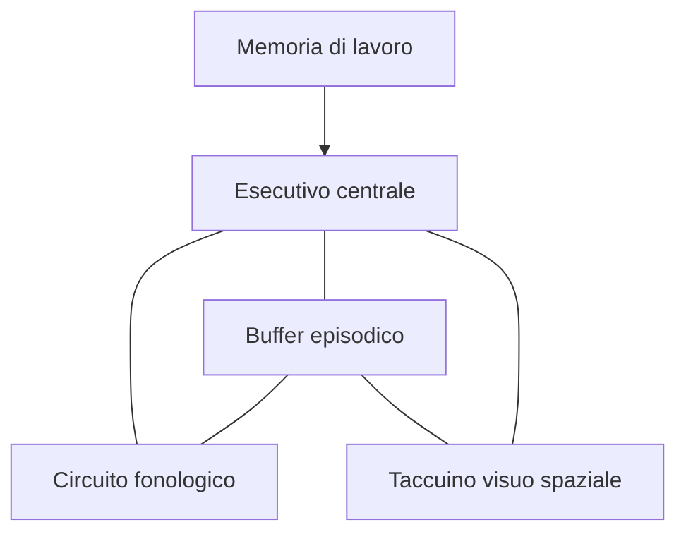

Questo modello arricchisce il *Modello classico della memoria di Atkinson e Shiffrin* e teorizza, sul concetto della MBT, una c.d. *memoria di lavoro* cioè ==una memoria a breve termine che viene utilizzata durante un'operazione cognitiva== (come la lettura, problem-solving, ecc..).

Il modello teorizza l'immagazzinamento temporaneo e la prima gestione/manipolazione dell'informazione attraverso il seguente sistema:
- Il **circuito esecutivo centrale**: 
	- E' un sistema di controllo attentivo che interviene nella *pianificazione e nella presa di decisione*. 
	- responsabile del controllo attentivo e della coordinazione delle informazioni.
- **Il circuito fonologico (o loop articolatorio)**: 
	- elabora le informazioni acustiche.
	- controlla l'articolazione del linguaggio.
	- le informazioni in questo settore decadono in circa 2 secondi.
- **Il taccuino visuo-spaziale**:
	- elabora le informazioni visive-spaziali.
- **Il buffer episodico**: 
	- Questo buffer funge da intermediario tra sottosistemi con codici diversi
		- recupera eventi dalla MLT.