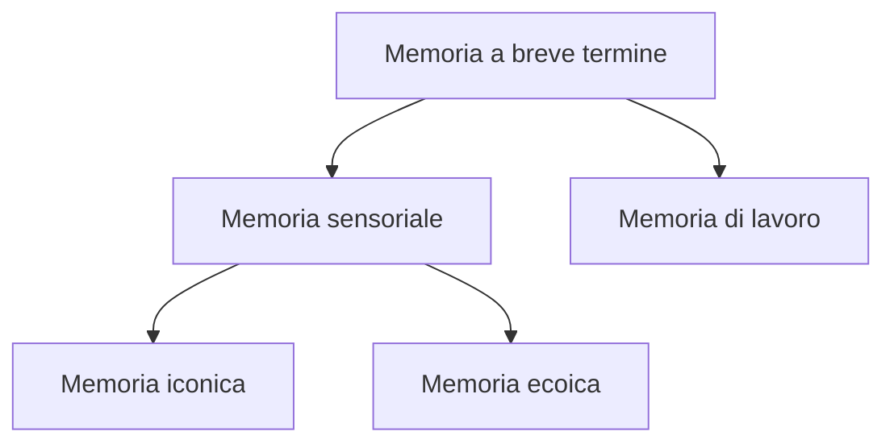

La memoria a breve termine (MBT) appresenta la seconda fase del processo di memorizzazione: secondo il modello di Atkinson-Shiffrin, le informazioni provenienti dalla memoria sensoriale vengono selezionate e trasferite alla memoria a breve termine per un'elaborazione più approfondita.

***Caratteristiche:***
- Capacità limitata
	- Può essere impiegata solo su un compito per volta
	- la MBT immagazzina *chunk* di informazioni (circa 7) ritenute utili.
- Breve durata
	- Dura pochi minuti
- Necessaria per le attività cognitive quotidiane (**Memoria di lavoro**)

