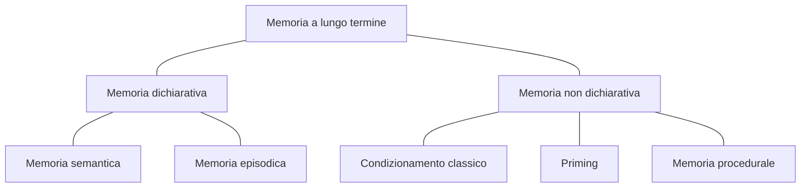

---
tags:
  - memory-semantica
  - memory-procedurale
  - memory-a-lungo-termine
---

La memoria a lungo termine (MLT) rappresenta la terza fase del processo di memorizzazione: quando *le nuove informazioni vengono elaborate in modo profondo*,  reiterate nel tempo e associate ad informazioni già esistenti queste possono passare alla memoria a lungo termine.

***Caratteristiche:***
- *Grande capacità*
- Lunga durata
- Informazioni organizzate e strutturate gerarchicamente.
	- Recuperare informazioni dalla memoria a lungo termine è dispendioso di energie.
