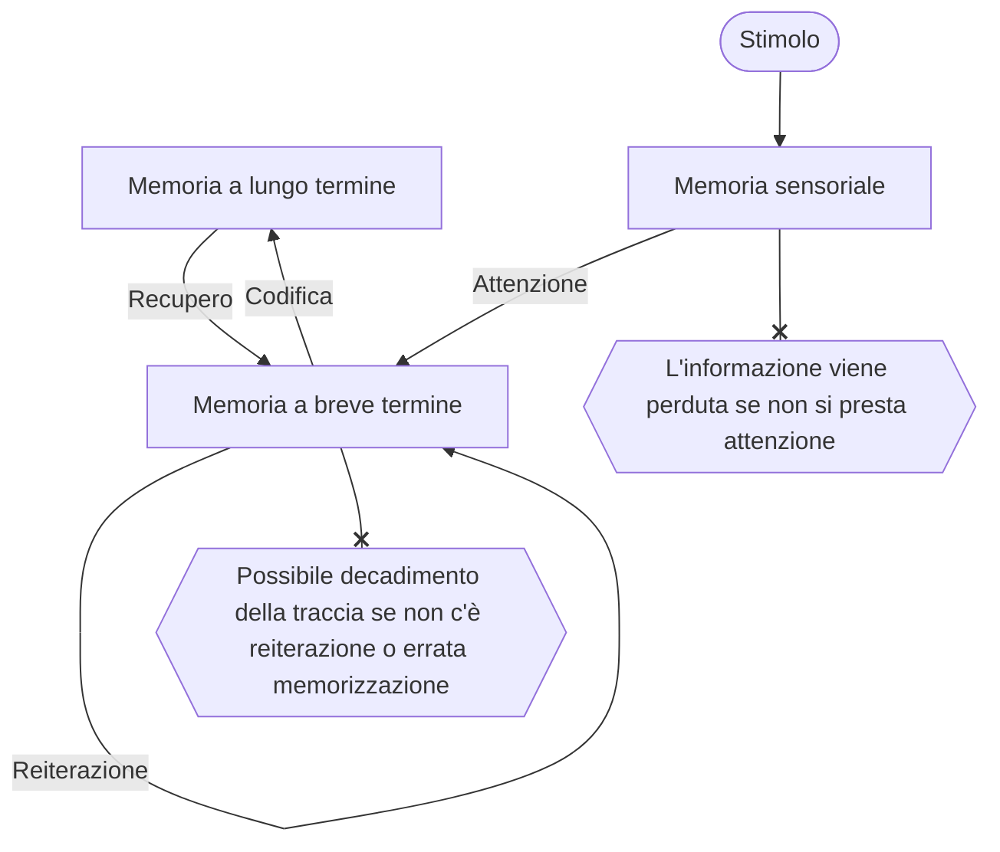

*Questo modello formulato negli anni 60 gettò le basi che permisero di comprendere il funzionamento della memoria.*

==Descrive il il modo in cui le informazioni vengono immagazzinate nella memoria==, suddividendo questa in tre stadi.
- Il modello suddivide la memoria in base alla durata della ritenzione del ricordo.
- I ricordi possono essere ripetuti ed elaborati per essere ricordati meglio e più a lungo.
# La memoria breve termine
![[Memoria a breve termine]]
## La memoria sensoriale
![[La memoria sensoriale]]
## Modello della memoria di lavoro (Baddeley e Hitch) 
![[La memoria di lavoro]] 

## Cos'è la memoria a lungo termine?
![[Memoria a lungo termine]]
## La memoria dichiarativa
![[La memoria dichiarativa]]
### La memoria semantica 
![[La memoria semantica]]
### La memoria episodica
![[Memoria episodica]]
