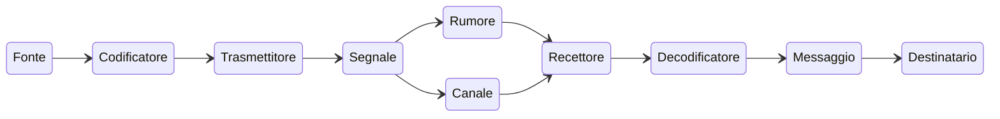

# Cos'è la teoria dell'informazione?
==Il **modello di matematico di informazione** è introdotto da *[[Claude Shannon]]* e *[[Weaver]]* intende la comunicazione come un processo di trasmissione di informazioni==: un segnale che passa dal emittente a destinatario.

- L'informazione passa..
	1. da una **fonte**
	2. attraverso un **trasmettitore**
	3. lungo un **canale** (più o meno disturbato da rumore)
	4. attraverso un **decodificatore**
	5. per infine arrivare al **recettore**
	6. Il **feedback** è un pacchetto di informazioni che dal ricevente ritorna al mittente.

> [!question] Il codice utilizzato è una componente fondamentale per una corretta comunicazione
> L'approccio matematico implica una teoria forte del codice poiché ritiene che le condizioni necessarie e sufficienti per comunicare sono:
> 1. Avere a disposizione un **codice** di trasmissione;
> 2. Un emittente in grado di **codificare**;
> 3. Un ricevente preposto a **decodificare**.
