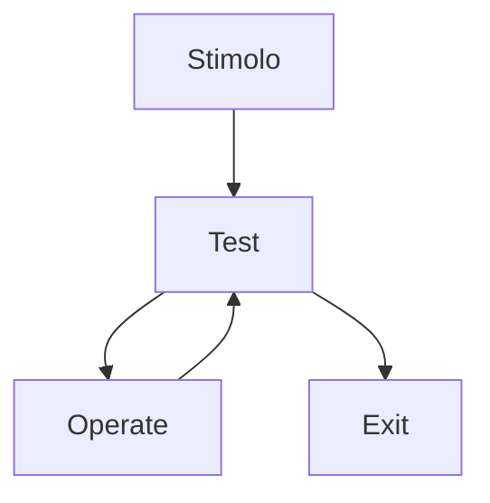

---
tags:
  - scienze-cognitive
  - human-information-processing
  - memory-and-mental-processes
---

>Teorizzata nel 1967 dallo psicologo Urlic Neisser.

Questa tendenza metodologica ==vede l'uomo come elaboratore di informazioni (Human Information Processing)==.
# Modello TOTE
Miller, Galanter e Pibram propongono il c.d. modello TOTE (*Test, Operate, Test, Exit*):
- E' un modello circolare basato sul concetto di **retroazione**: ==l'informazione ritorna al soggetto nel momento stesso in cui egli sta compiendo l'azione.==

1. Test --> Verifica di congruenza.
2. Operate --> Se verificata un'incongruenza, svolgimento azione.
3. Test
4. Exit --> Azione eseguita.

# Modello della simulazione
Il cognitivismo utilizza la *simulazione del comportamento* come metodo di indagine, 
- Le operazioni mentali possono essere simulate in modo da intercettare quelle che si ipotizza intervengano nell'esecuzione di un certo compito.

✅ Vantaggi:
- I processi mentali interni possono essere studiati e trascritti in istruzioni di un programma, per poi essere manipolate.
- Introducendo delle variazioni è possibile considerarne gli effetti.

⛔ Limiti:
- Occorre formulare ipotesi precise.
- Come facciamo ad essere certi che le "istruzioni" siano corrette?
# [[La memoria]] e i suoi processi
==Il cognitivismo considera notevolmente il ruolo della memoria e dei processi mentali.==
- Attraverso vari processi mentali (tra cui attenzione, percezione, linguaggio) gli uomini acquisiscono, trasformano, elaborano, archiviano e recuperano le informazioni.
## [[Attenzione]]
## [[Comunicazione (Psicologia)]]
## [[Sensazione, percezione, psicofisica]]
# [[Emozioni]]