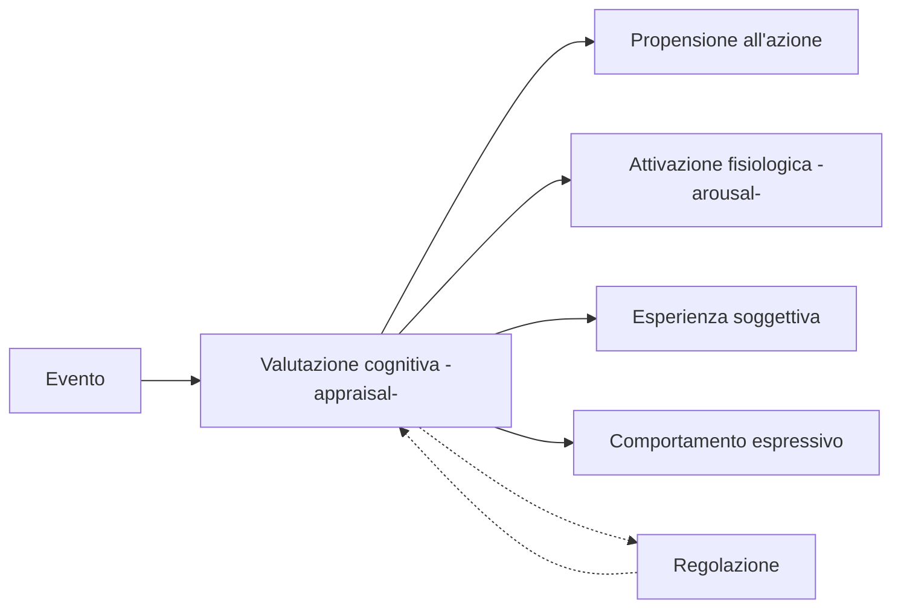

La ricerca contemporanea ha sottolineato il ruolo positivo delle emozioni: ==queste sono **mediatori** nella *relazione tra organismo e ambiente* e puntano a mantenere il benessere dell'organismo *stimolandolo a compiere azioni necessarie al mantenimento del proprio equilibrio*.==
- Una prima concezione vedeva le emozioni sotto una luce negativa, come un *segnale interno ad alta priorità* che ha la capacità di interrompere ogni altra attività. 

![[Pasted image 20240604233958.png]]
Le emozioni ci permettono di:
- **Valutare l'ambiente** (o appraisal): le emozioni permettono di valutare costantemente gli stimoli, interni ed esterni, in relazione alla rilevanza per l'organismo, preparandolo ad una *risposta emozionale* .
- **Regolazione dello stato di attivazione del sistema** (o arousal): coordinare le risposte dei sistemi biologici, generando uno stato fisiologico ottimale,
- **Modellare il comportamento futuro:** le emozioni ci aiutano ad apprendere risposte che ci aiuteranno a predisporre reazioni appropriate nel futuro (portano a ricercare o meno una situazione che rafforzi il comportamento).
- **Ottenere un'interazione efficace:** comunicando le emozioni provate tramite la comunicazione verbale o il comportamento non verbale, rendendo esplicite agli altri le nostre amozioni.
# Componenti del processo emotivo

Le componenti del fenomeno emotivo corrispondono ai diversi sistemi di risposta e il processo emotivo consisterebbe nelle modificazioni di tali sistemi. E' possibile distinguere cinque sistemi o componenti:
1. **La componente cognitiva** (o *appraisal*), deputata alla rilevanza cognitiva di oggetti ed eventi
2. **La componente di attivazione fisiologica** (o *arousal)* che regola gli stati del corpo
3. **La componente motivazionale** (o di *tendenza all'azione*) che prepara l'organismo ad agire in modo adattivo sull'ambiente (ad esempio attacco *vs* fuga).
4. **La componente espressivo-motoria** che comprende i sistemi di espressione (movimenti facciali, sistema vocale)
5. **La componente esperenziale** (o *subjective feeling*) che corrisponde all'esperienza soggettiva interna all'emozione così come percepita dal soggetto.
# Teorie classiche

==Le teorie classiche riguardano il rapporto tra risposte fisiologiche e l'esperienza emotiva:==
- **Teoria periferica dell'emozione:** specifiche reazioni fisiologiche causano l'esperienza di particolari emozioni.
- Altre teorie sostengono che la reazione fisiologica sia un risultato dell'esperienza emotiva.
## La teoria periferica dell'emozione (James-Lange)
> ![[Pasted image 20240605002812.png]]
>*Secondo la teoria periferica dell'emozione sono le reazioni del corpo a causare le emozioni.*

William James sostenne che la percezione di un evento attivante è direttamente seguita da modificazioni corporee e che l'esperienza emotiva corrisponde al sentire queste stesse modificazioni nel momento in cui si verificano: ==l'emozione non viene immediatamente indotta dalla percezione di un evento, ma dai **i cambiamenti corporei** che quindi si interpongono tra i due perciò l'esperienza emotiva è dovuta a mere reazioni fisiologiche.==
- *Periferica* perché fa riferimento alla localizzazione delle modificazioni fisiologiche (sistema cardiocircolatorio, vescica, ghiandole salivari, ecc..)
- In quest'ottica ***l'emozione coincide con la dimensione corporea***.
	- "Non tremiamo perché abbiamo paura ma abbiamo paura perché tremiamo; non piangiamo perché siamo tristi ma siamo tristi perché piangiamo…"
	- Per ciascuna emozione esiste una reazione fisiologica che la accompagna.

> [!success] L'esperimento
> I risultati di un esperimento mostrarono che l'assunzione volontaria delle espressioni facciali corrispondevano:
> - all'esperienza soggettiva della stessa emozione, 
> - all'attivazione differenziata del sistema nervoso autonomo.
> 
>La modificazione del comportamento facciale, ottenuta tramite l'esagerazione o l'inibizione delle espressioni, dimostrò come un'emozione può essere intensificata o ridotta.
> *Distendere la fronte, adottare una buona postura, fare complimenti può effettivamente portarci ad assumere uno stato emotivo positivo!*

> [!error] ***Critiche***
> - I cambiamenti viscerali accadono troppo lentamente perché tali modificazioni possano essere la causa di un'esperienza emotiva immediata.
> - I visceri producono una serie molto limitata di sensazioni
> - L'induzione sperimentale di alcune modificazioni fisiologiche che caratterizzavano le emozioni di base, attraverso l'iniezione di adrenalina, non suscitava alcuna esperienza emotiva.
## La teoria centrale delle emozioni (Cannon-Bard)

> ![[Pasted image 20240605002842.png]]
>*Secondo la teoria centrale delle emozioni sono le attività del cervello a originare le emozioni.*

La teoria centrale delle emozioni rifiuta l'idea che cambiamenti fisiologici, da soli, possono portare alle emozioni e sostiene che l'attivazione fisiologica e l'esperienza emotiva sono causate da uno stimolo nervoso.
- La teoria centrale delle emozioni ebbe il merito di individuare strutture cerebrali specifiche delle emozioni.
	- Grazie alle osservazioni cliniche e sperimentali si scoprì che l'organizzazione neuronale che scaturisce le emozioni risiede nel talamo.
	- Si scoprì che la struttura sotto-corticale del talamo ha un ruolo centrale sia nell'attivazione fisiologica, sia nell'esperienza emotiva.

> [!error] ***Critiche***
> - La contemporaneità delle risposte emotive e fisiologiche deve ancora essere studiata.
> - L'ipotesi non considera variabili di tipo cognitivo, sociale o culturale.
## La teoria cognitivo-attivazionale (Schachter-Singer)

> ![[Pasted image 20240605002935.png]]
> *Secondo la teoria cognitivo-attivazionale sono i pensieri a formare le emozioni.*

La teoria cognitivo-attivazionale (anche chiamata teoria bi-fattoriale o teoria attribuzionale) introduce una componente psicologica nello studio delle emozioni, affiancando all'attivazione fisiologica il ruolo della cognizione. ==Secondo la teoria cognitivo-attivazionale le emozioni sono determinate dall'attivazione fisiologica, dal riconoscimento di tale attivazione e dalla sua attribuzione causale.==
- Il tipo di emozione provata varia in funzione della sua interpretazione cognitiva, ovvero del tipo di evento a cui l'attivazione è attribuita.

> [!danger] ***Critiche***
> - Gli esperimenti dimostrarono che l'attivazione fisiologica potrebbe non essere una condizione necessaria come sostiene la teoria.
> - Studi successivi non riuscirono a replicare i risultati degli esperimenti condotti per dimostrare la teoria.
> - Le reazioni fisiologiche non sono così indifferenziati come la teoria vorrebbe e non sono neutre: *l'induzione artificiale e non spiegata di attivazione fisiologica attraverso iniezioni di adrenalina conduce a sperimentare uno stato affettivo negativo.*

# Teorie contemporanee
Esistono diverse teorie in quanto le emozioni sono fenomeni complessi e strettamente legate da motivazione, cognizione e neuroscienze:
## Le teorie dell'appraisal
Secondo le teorie dell'appraisal ==le emozioni dipendono dal modo in cui gli individui interpretano e valutano gli eventi e gli stimoli== provenienti dall' ambiente.
- Per "*appraisal*" si intende la valutazione diretta e immediata di un evento da parte del soggetto (non ha a che vedere con la consapevolezza o la riflessione).
- Il processo di valutazione cognitiva di una situazione (**l'antecedente emotivo**) avviene in funzione di alcuni criteri (o dimensioni) di valutazione.
	- L'emozione provata dipende dagli esiti della valutazione per ciascuno di quei criteri.
### La prospettiva dimensionale (Wundt, 1896)
==Definisce le emozioni come processi che variano secondo alcune dimensioni continue.==
- Sosteneva che i sentimenti variassero lungo 3 assi: 
	1. gradevolezza *vs* sgradevolezza, 
	2. eccitazione *vs* calma, 
	3. tensione *vs* rilassamento.
### Il mero effetto espositivo (Zajonc)
Lo psicologo Zajonc appoggia le *Teorie dell'appraisal*: sostiene che ==esiste un meccanismo, Il *mero effetto espositivo* per cui le persone tendono a sviluppare una preferenza per le cose semplicemente perché hanno familiarità con esse.==

- La piacevolezza/spiacevolezza si scoprì essere determinati dal significato che i soggetti vi attribuiscono. Sono state trovate delle correlazioni tra grado di novità ed interesse (Le leggi di Frijda):
	1. **Legge del significato situazionale**: Le emozioni cambiano in base ai significati attribuiti alla situazione
		- Novità della situazione.
	2. **Legge dellʼinteresse**: Le emozioni nascono in risposta a ciò che i soggetti percepiscono come rilevante.
		- Grado di piacevolezza.
## Le teorie evoluzioniste
Darwin si interessò allo studio delle espressioni facciali, che scoprì essere:
1. Innate.
2. Presenti nei primati.
3. Universalmente condivise e associate a determinate emozioni.
	- Le espressioni emotive (in particolar modo quelle primarie come rabbia, tristezza, gioia, paura..) sono importanti mezzi di segnalazione dei propri stati emotivi, utili in caso di emergenza.
		- Le emozioni di base hanno un ruolo adattivo
		- Le emozioni secondarie derivano dalla combinazione delle emozioni di base e dipendono per lo più dalla cultura e dall'apprendimento.
### Prospettiva categoriale
Le *Teorie evoluzioniste* si muovono all'interno di una *prospettiva catagoriale* che vede le emozioni come:
- Categoricamente **distinte** ed **innate**.
	- **Ciascuna emozione di base è unità discreta**: ogni emozione si differenzia dalle altre per uno specifico profilo o configurazione di risposte fisiologiche (soprattutto in termini di risposte facciali).
- Processi fisiologici **unitari**, pre-codificati geneticamente.
	- Non ulteriormente scomponibili.
### Prospettiva culturalista *vs* innatista
- Secondo la prospettiva culturalista l'espressione delle emozioni varia in base alla cultura, poiché essa sviluppa modelli mentali necessari ad interpretare la realtà e ad agire su di essa.
- Secondo la prospettiva innatista la capacità di riconoscere una determinata emozione tra individui di diverse culture si sviluppa a prescindere dallo stimolo ambientale.
	- *Ad esempio i bambini ciechi dalla nascita presentano espressioni emotive fondamentali, pianto, riso, rabbia ecc..*

## Teoria del core affect (Russel)
Si basa sul *core affect*, uno stato neurofisiologico di base (che non coincide direttamente con le emozioni ma le comprende!) accessibile e privo di un oggetto specifico: una volta direzionato verso un oggetto emotivo prende forma un'emozione.
- Alla base di ogni emozioni esistono degli stati che possono essere esperiti semplicemente (bene *vs* male, attivi *vs* senza energia).
	- Vengono distinti **stati emotivi** che hanno *valenza edonica* (tristezza, felicità) e **stati non emotivi** che hanno a che vedere con l'*arousal* (affaticamento, calma).
- Ognuno ha un core effect con un livello base diverso, con una responsività diversa.

![[Pasted image 20240605032554.png|500]]

***Come funziona?***
1. Modificazione del core affect e percezione del cambiamento.
	1. **Il core affect:** Questo primo stadio risponde agli stimoli producendo cambiamenti più o meno rapidi, più o meno intensi nello spazio bidimensionale che lo caratterizza.
	2. **La percezione delle proprietà affettive:** Nel secondo stadio ==gli oggetti arrivano alla coscienza, già interpretati e connotati dal punto di vista affettivo (ad esempio spiacevole o piacevole).==
	- La modificazione innesca la ricerca della causa
2. **Attribuzione del cambiameto** ad una causa specifica il cui valore edonico corrisponde a quello del core affect.
	- **L'oggetto è il risultato dei processi psicologici** e può essere definito ciò che l'individuo crede che lo stia facendo sentire in un certo modo, sulla base dei propri obiettivi.
3. **Attivazione fisiologica:** Questo sentire determina a successiva reazione agli stimoli.

***Implicazioni:***
Secondo Russel dunque 
- Le emozioni non corrispondono a categorie distinte e biologicamente determinate.
- La sequenza di eventi che genera un episodio emotivo non è fissa ma è costruita di volta in volta a seconda delle circostanze.
## Teoria del marcatore somatico (Damasio)
La teoria del marcatore somatico si fonda sul concetto di marcatore somatico, cioè il modo predisposto dall'evoluzione per consentire all'uomo di adottare risposte comportamentali agli stimoli ambientali che ne favoriscano la sopravvivenza.
Damasio appoggiò fin da subito *la teoria periferica dell'emozione* di James sottolineando l'importanza del corpo nel funzionamento del sistema emotivo.
In questa prospettiva ==l'emozione è l'insieme dei cambiamenti degli stati a livello corporeo e cerebrale innescati da un insieme di sistemi neurali che corrisponde alle percezione dell'individuo relativo all'oggetto emotivo, utili per arrangiare una risposta emotiva.==
- La teoria si riferisce ad una capacità naturale di "marcare" (e quindi valutare) l'informazione percettiva proveniente dall'esterno.
	- Quando una situazione simile si verifica ancora, una reazione automatica è innescata.

***Come funziona?***
- La percezione di un oggetto elicitante, processato da strutture celebrali specifiche (ad esempio l'amigdala), innesca modificazioni degli stati del corpo che includono modificazioni fisiologiche (ad esempio l'aumento del battito cardiaco), sia cambiamenti nel sistema muscolare-scheletrico (movimenti facciali, posturali..)
	- L'insieme di tutte queste modificazioni (c.d. **risposte somatiche**) costituiscono l'emozione (che viene distinda dal sentimento che corrisponde all'esperienza cosciente dell'oggetto).
	- Sono segnali che guidano o influenzano le decisioni future.

### Emozioni primarie e secondarie
- **Emozioni primarie** (o emozioni alla James): sono una risposta automatica e istintiva agli stimoli esterni.
	 - E' una forma di partecipazione emotiva che si concretizza in una serie di risposte somatiche (visceri, i muscoli scheletrici, le ghiandole endocrine, il sistema vascolare e immunitario).
	 - Le emozioni primarie sono considerate innate e preorganizzate e si legano alla parte più antica del nostro cervello (il sistema limbico).
	 - Sono innescate da **induttori primari**: stimoli innati o appresi che una volta presenti nell'ambiente, automaticamente generano una risposta somatica (ad esempio vedere un serpente).
 - **Emozioni secondarie:** rappresentano il passo successivo nell'elaborazione dell'esperienza emotiva.
	 - Esse nascono una volta che abbiamo cominciato a provare sentimenti e a formare connessioni sistematiche tra categorie di oggetti da un lato ed emozioni primarie dall'altro.

> [!success] LʼIowa Gambling Task
> Vengono mostrati 4 mazzi di carte, 2 dove la possibilità di vincita è bassa ma la perdita è minore, e 2 dove la possibilità di vincita è alta ma la perdita è maggiore.
> - I risultati dimostrano che i soggetti tendono a fare la scelta vantaggiosa che porta ad una vincita a lungo termine mentre i soggetti con lesione alla corteccia non sviluppano questa abilità e pescano indifferentemente dal mazzo.

# Multi-modalità delle emozioni
Per multi-modalità delle emozioni si intende la ==capacità di un individuo di esprimere uno stato emotivo attraverso molteplici sistemi espressivi== (ad esempio il movimento del volto, il tono della voce, i gesti..)
- Non tutti i sistemi hanno la stessa efficacia comunicativa
	- Il volto è il canale previlegiato.
		- La comunicazione attraverso le espressioni faciali aiutano nell'immediatezza o spontaneità dell'emozione (prospettiva emotiva) e nelle intenzioni, assumendo un valore sociale (prospettiva comunicativa).
	- Postura, gesti non sono in grado di esprimere un'emozione specifica.
## Le espressioni facciali
La maggior parte degli studi sulle espressioni facciali sono stati condotti all'interno delle teorie evoluzioniste e delle emozioni di base. 
- Secondo la **tesi dell'universalità delle espressioni facciali** esistono configurazioni di movimenti facciali prototipiche ed innate (*tesi innatista*), riconoscibili universalmente.
- **L'approccio culturale** (Birdwhistell, 1970) sosteneva il carattere appreso delle espressioni facciali e le variazioni tra culture diverse nel comportamento espressivo.
### La teoria neuro-culturale (Ekman, 1972)
Nel tentativo di risolvere la contraddizione tra *universalità* e *aspetto culturale* delle emozioni Ekman propose la *teoria neuro-culturale* che invoca l'intervento di due fattori: ==una componente neurofisiologica (carattere innato) e una culturale (carattere culturale-cognitivo).==
- **Carattere innato:** ogni emozione di base è caratterizzata da un "programma facciale", che viene attivato da eventi elicitanti a livello neuronale .
-  **Carattere culturale-cognitivo:** solo* le regole di esibizione* che corrispondono a meccanismi, appresi nel processo di socializzazione, che interagiscono con i programmi espressivi innati.
	- *Le regole di esibizione* sono norme definite socialmente e culturalmente che specificano chi può manifestare una certa emozione, in quali circostanze e contesti, secondo quali modalità ecc..
	- L'esecuzione dei programmi innati può essere influenzata da regole di esibizione.

***Si distinguono 4 regole di regolazione emotiva:***
1. Intensificazione;
2. Deintensificazione;
3. Neutralizzazione (o inibizione);
4. Mascheramento (o simulazione).
### L'analisi delle espressioni facciali
Per quanto riguarda la natura e le modalità con cui le espressioni facciali sono studiate, riconosciamo:
- *L'approccio molare* (o globale, sostenuto da Ekman) che considera le espressioni facciali delle configurazioni di movimenti muscolari fisse, distinte e specifiche.
	- Ricordiamo il Facial Action Coding System (FACE) che definisce i muscoli associati alle varie emozioni.
- *L'approccio molecolare* (o dinamico) che considera le espressioni facciali la risultate del progressivo processo di valutazione cognitiva dello stimolo.
### Ipotesi del feedback facciale (Ekman)
==Ipotesi secondo la quale le espressioni facciali forniscono informazioni capaci di influenzare l'elaborazione emotiva.==
- **La versione forte:** sostenuta da Ekmna ritiene che una configurazione di movimenti facciali possa elicitare una determinata emozione
- **La versione debole:** sostiene che il feedback facciale aumenti solamente l'intensità e la durata dell'emozione.

>![[Pasted image 20240605001906.png|550]]
> L'attivazione volontaria delle manifestazioni di un'emozione dovrebbe essere in grado di provocare l'emozione stessa.

Lo studio specifico della conformazione facciale (attraverso il *Facial Action Coding System* di Ekman e Friesen, 1978) ha rilevato la presenza di 44 unità di azione muscolare, le quali, combinandosi tra loro, danno origine a più di settemila movimenti visibili del volto, ad esempio:
- digrignare i denti, stringere gli occhi e corrugare la fronte, appare collegato ad espressioni di disprezzo e rabbia;
- sgranare le pupille, sollevare le sopracciglia e tirare all'indietro gli angoli della bocca sembrerebbe in grado di attivare risposte di vigilanza, allerta e paura;
- distendere le labbra e tendere le guance servirebbe a favorire espressioni serene e sorridenti;
#### Teoria vascolare dell'efferenza emotiva (Zajonc, 1985)
Lo psicologo Zojonc approfondì ulteriormente gli studi del feedback facciale con *l'ipotesi vascolare* secondo cui i ==muscoli facciali hanno un ruolo fondamentale nella termoregolazione corporea== per via della loro capacità di influenzare l'efflusso sanguigno di sangue al volto.
- Il raffreddamento ipotalamico è associato a stati emotivi positivi.
- L'innalzamento della temperatura ipotalamica è associato a stati emotivi negativi.

>![[Pasted image 20240605002217.png]]
>*Esercitando una pressione meccanica sulle vene facciali è possibile ridirigere il sangue verso il seno cavernoso che gioca un ruolo importante nella termoregolazione corporea.*

